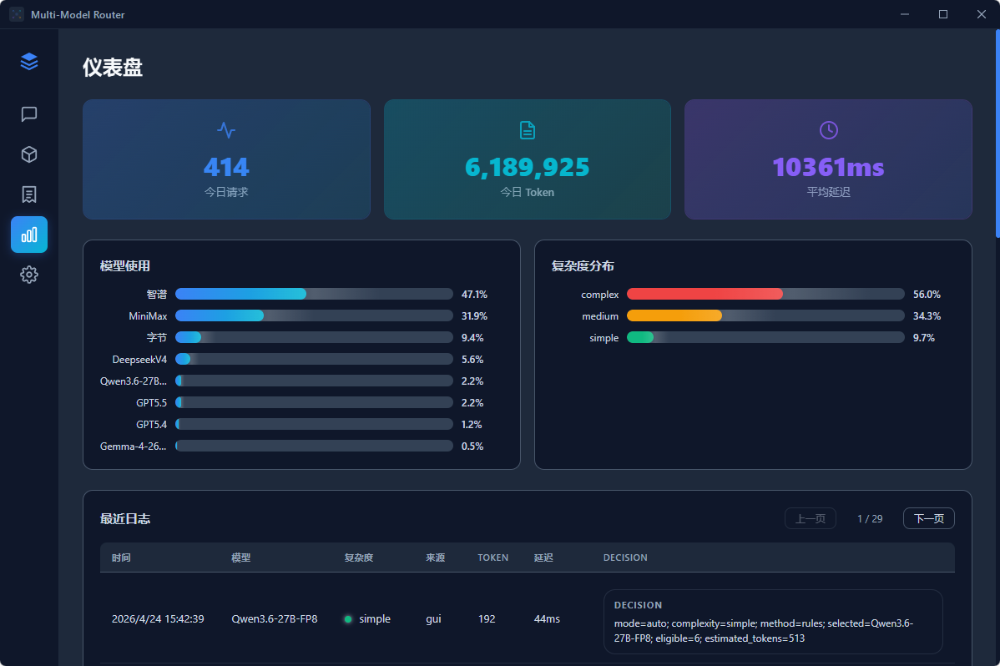
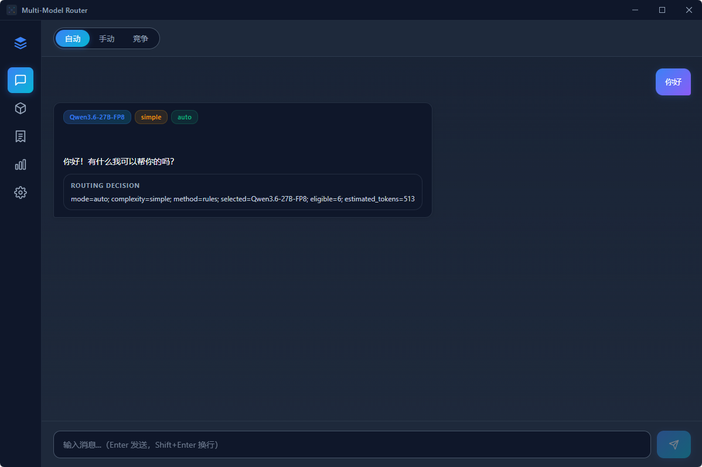
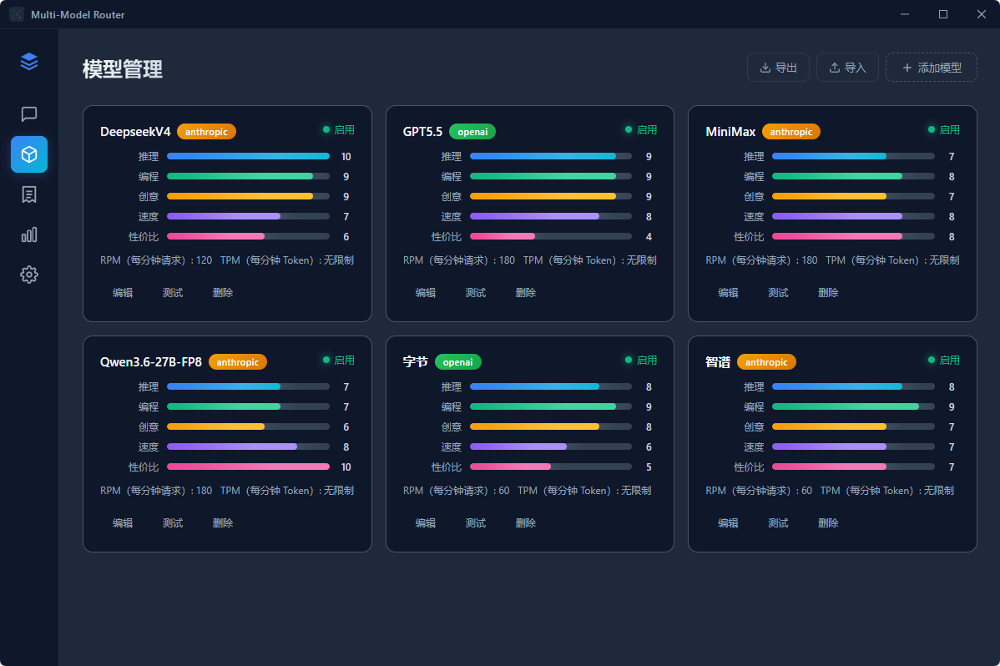
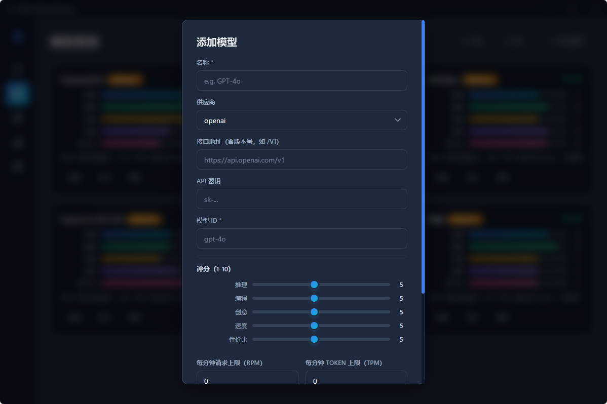
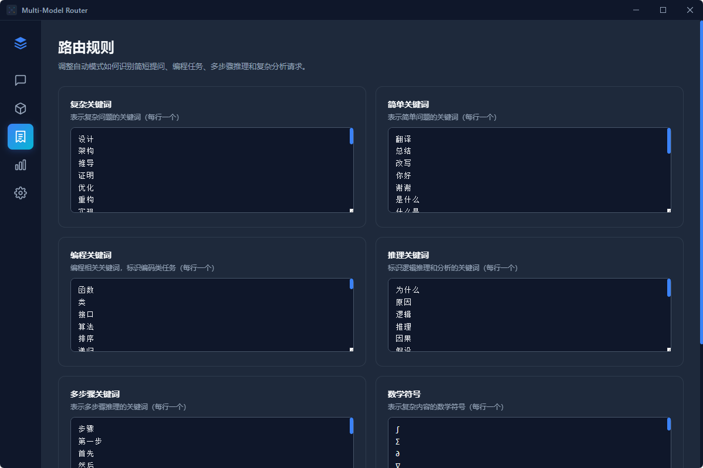
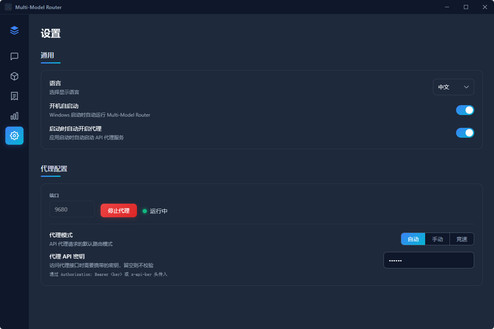

# Multi-Model Router

<p align="center">
  
</p>

<p align="center">
  <strong>AI 模型智能路由代理</strong><br>
  自动分析请求复杂度，从多个 AI 模型中选出最优解<br>
  支持 OpenAI · Anthropic · Google · Ollama · 自定义兼容接口
</p>

<p align="center">

[](https://opensource.org/licenses/MIT)
[](https://golang.org/)
[](https://wails.io/)
[](https://github.com/ethanfly/multi_model_router)

</p>

---

## 这是什么？

**Multi-Model Router** 是一个本地运行的 AI 模型路由代理。你接入多个 AI 模型后，它自动判断每个请求的复杂度——简单问候发给便宜模型，复杂编程发给强力模型——你只需要用同一个 API 地址。

### 三种运行形态

| 形态 | 说明 |
|------|------|
| **桌面 GUI** | 完整可视化界面，管理模型、聊天测试、查看仪表盘 |
| **终端 TUI** | 命令行交互界面，无需图形环境 |
| **Headless 服务** | 纯后台代理，适合服务器部署 |

---

## 界面一览

### 仪表盘

实时监控请求量、Token 消耗、延迟分布，以及每个模型的使用占比和请求复杂度分布。

<p align="center">
  
</p>

### 智能聊天

三种路由模式一键切换——自动模式零配置智能选模型，手动模式指定模型，竞速模式多模型并发取最快响应。

<p align="center">
  
</p>

### 模型管理

统一管理所有 AI 模型，五维评分（推理 / 编程 / 创意 / 速度 / 性价比），支持导入导出加密配置。

<p align="center">
  
</p>

<details>
<summary>查看更多截图</summary>

#### 添加模型

配置 API 地址、密钥、模型 ID，自定义五维评分和速率限制。

<p align="center">
  
</p>

#### 路由规则

自由定义关键词规则，决定什么内容算"简单"、什么算"编程"、什么算"复杂"——路由行为完全可控。

<p align="center">
  
</p>

#### 设置

中英双语、开机自启、代理端口、API 密钥认证，集中配置。

<p align="center">
  
</p>

</details>

---

## 快速开始

### 下载安装

从 [Releases](https://github.com/ethanfly/multi_model_router/releases) 下载最新 `MultiModelRouter-v*.exe`，双击运行即可。

### 三步接入

```
1. 模型 → 添加模型（填入 API Key 和模型 ID）
2. 设置 → 配置端口 → 启动代理
3. 将客户端 API 地址改为 http://localhost:9680/v1
```

随后所有 OpenAI 兼容客户端（ChatBox、Cursor、Continue、自定义代码等）都能直接使用，无需逐个配置模型。

---

## 代理 API

完全兼容 OpenAI `/v1/chat/completions` 协议。

### 认证

```bash
# Authorization Bearer（推荐）
curl http://localhost:9680/v1/chat/completions \
  -H "Authorization: Bearer YOUR_PROXY_KEY" \
  -d '{"model":"auto","messages":[{"role":"user","content":"Hello"}]}'

# x-api-key 头
curl http://localhost:9680/v1/chat/completions \
  -H "x-api-key: YOUR_PROXY_KEY" \
  -d '{"model":"auto","messages":[{"role":"user","content":"Hello"}]}'
```

未配置密钥时跳过认证，适合本地开发环境。

### 路由控制

| `model` 参数 | 行为 |
|-------------|------|
| `"auto"` 或留空 | 自动模式：根据请求复杂度智能选择模型 |
| `"race"` | 竞速模式：所有启用模型并发请求，最快响应返回 |
| `"gpt-4o"` 等具体名称 | 手动模式：直接路由到指定模型 |

### 三种路由模式

| 模式 | 原理 | 适用场景 |
|------|------|------|
| **自动 (auto)** | 关键词 + 规则匹配 → 判定复杂度（简单/中等/复杂）→ 按评分选模型 | 日常使用，零配置 |
| **手动 (manual)** | 请求中指定 `model`，不走路由逻辑 | 需要特定模型能力 |
| **竞速 (race)** | 所有启用模型同时请求，谁先返回用谁 | 对延迟敏感的场景 |

---

## 命令行

```bash
# 帮助
MultiModelRouter.exe --help

# 版本
MultiModelRouter.exe version

# Headless 代理（无 GUI，适合服务器）
MultiModelRouter.exe serve --port 9680 --mode auto

# 终端交互界面
MultiModelRouter.exe tui
```

### 子命令

| 命令 | 说明 | 参数 |
|------|------|------|
| `serve` | 启动无头代理服务器 | `-p, --port` 端口（默认 9680）<br>`-m, --mode` 路由模式（auto/manual/race）<br>`-k, --api-key` 代理密钥 |
| `tui` | 终端交互管理界面 | `-p, --port` 默认端口 |
| `version` | 输出版本号 | — |

### TUI 快捷键

| 按键 | 功能 |
|------|------|
| `1` / `2` / `3` | 切换标签页（状态 / 模型 / 统计） |
| `s` | 启动 / 停止代理 |
| `r` | 重新加载模型列表 |
| `↑` / `↓` | 列表导航 |
| `q` / `Ctrl+C` | 退出 |

---

## 项目结构

```
multi_model_router/
├── main.go                    # 入口：GUI / CLI 分发
├── app.go                     # Wails GUI 绑定层
├── app_windows.go             # Windows 平台实现
├── app_unix.go                # Unix 平台存根
├── trayicon.go                # 系统托盘图标
│
├── frontend/                  # Vue 3 + TypeScript 前端
│   └── src/
│       ├── views/             # ChatView / DashboardView / ModelsView / RulesView / SettingsView
│       ├── components/        # TitleBar / ModelCard / ModelEditor / MessageBubble 等
│       ├── stores/            # Pinia 状态管理
│       └── i18n/              # 中英双语
│
├── internal/
│   ├── core/                  # 核心业务逻辑（GUI/CLI 共用）
│   ├── cli/                   # CLI 命令（cobra）
│   ├── tui/                   # 终端 UI（Bubble Tea）
│   ├── router/                # 路由引擎 & 请求复杂度分类器
│   ├── provider/              # AI 供应商适配（OpenAI / Anthropic）
│   ├── proxy/                 # HTTP 代理服务器（OpenAI 兼容协议）
│   ├── config/                # 配置管理
│   ├── db/                    # SQLite 数据库 & 迁移
│   ├── stats/                 # 请求统计收集
│   ├── crypto/                # API Key AES-256-GCM 加密
│   ├── autostart/             # Windows 开机自启动
│   └── wintray/               # Windows 系统托盘集成
│
├── scripts/
│   └── generate-icons.mjs     # SVG → PNG / ICO 图标生成
│
├── docs/                      # 文档资源
├── build/                     # 构建产物 & 图标
├── screenshots/               # 应用截图
├── build.bat                  # Windows 构建脚本
└── build.sh                   # Linux/macOS 构建脚本
```

---

## 开发

### 环境要求

| 依赖 | 版本 |
|------|------|
| Go | 1.25+ |
| Node.js | 18+ |
| Wails CLI | v2 |

```bash
# 安装 Wails CLI
go install github.com/wailsapp/wails/v2/cmd/wails@latest
```

### 开发模式

```bash
wails dev          # 启动热重载开发服务器
```

### 构建

```bash
build.bat          # Windows
./build.sh         # Linux / macOS

# 或直接
wails build -clean -ldflags "-s -w"
```

构建产物：`build/bin/MultiModelRouter.exe`

---

## 技术栈

| 层级 | 技术 |
|------|------|
| 桌面框架 | [Wails v2.12](https://wails.io/) |
| 后端语言 | Go 1.25 |
| CLI 框架 | [Cobra](https://github.com/spf13/cobra) |
| TUI 框架 | [Bubble Tea](https://github.com/charmbracelet/bubbletea) |
| 数据库 | SQLite（[modernc.org/sqlite](https://modernc.org/sqlite)，纯 Go，无 CGo） |
| 前端框架 | Vue 3 + TypeScript |
| 状态管理 | Pinia |
| 路由 | Vue Router 4 |
| 国际化 | vue-i18n |
| 加密 | golang.org/x/crypto（AES-256-GCM / PBKDF2） |

---

## License

MIT License — 详见 [LICENSE](LICENSE)
